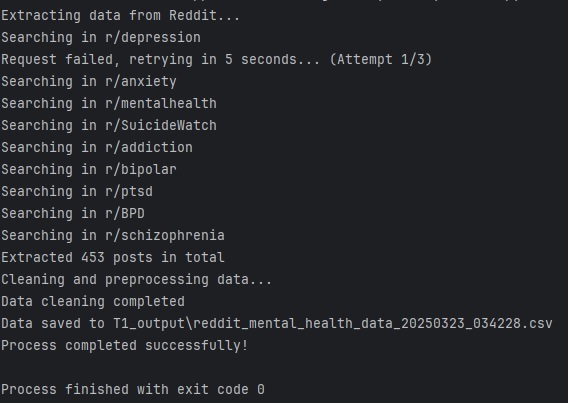
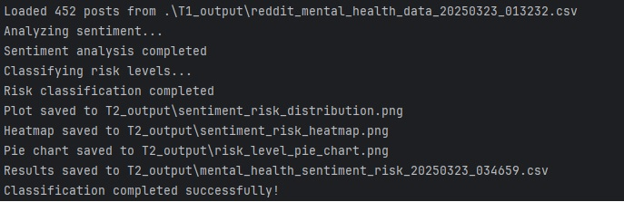
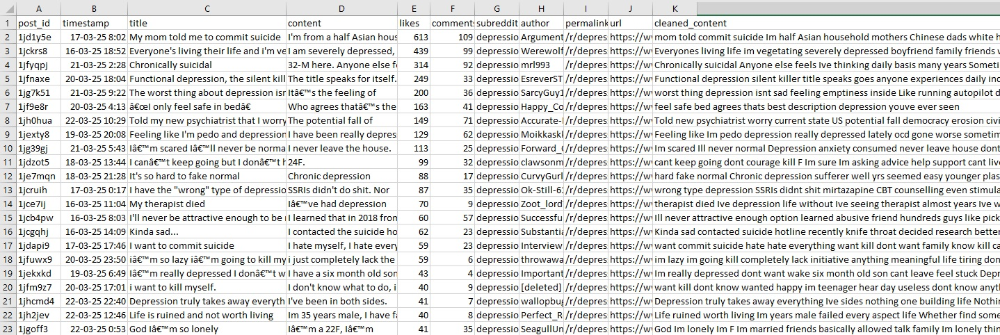
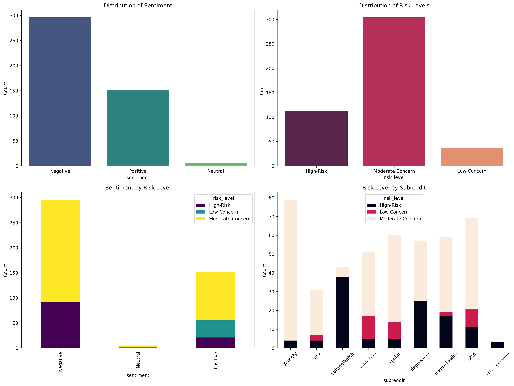
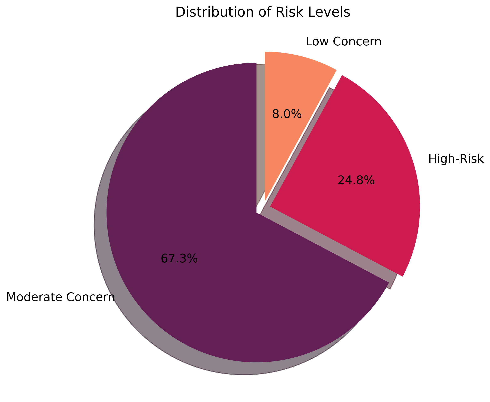
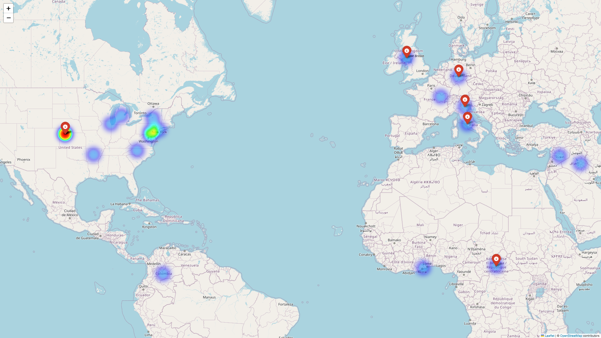
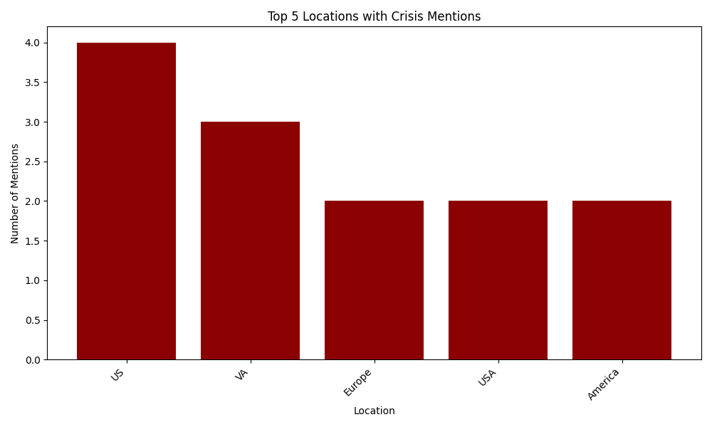

# Mental Health Crisis Analysis - GSOC 2025 Test Submission

## Project Title: AI-Powered Behavioral Analysis for Suicide Prevention, Substance Use, and Mental Health Crisis Detection with Longitudinal Geospatial Crisis Trend Analysis

## Project Overview
This project implements a comprehensive pipeline for analyzing mental health-related discussions on Reddit, focusing on crisis detection, sentiment analysis, and geographical visualization.

## Test Requirements Fulfillment

### ✅ Task 1: Social Media Data Extraction & Preprocessing
- Implemented Reddit API integration using PRAW
- Applied keyword filtering for mental health discussions
- Created structured data storage system
- Implemented text preprocessing

### ✅ Task 2: Sentiment & Crisis Risk Classification
- Implemented VADER sentiment analysis
- Created risk level classification system
- Generated statistical visualizations
- Applied TF-IDF for term importance

### ✅ Task 3: Crisis Geolocation & Mapping
- Implemented location extraction using SpaCy NLP
- Created interactive heatmaps with Folium
- Generated geographical statistics
- Visualized regional crisis patterns

### Components
1. Reddit Data Collection (T1_RMHDCscript.py)
2. Sentiment & Risk Analysis (T2_NLPtxtProcessing.py)
3. Geographical Analysis & Visualization
(T3_Geo_Analysis_Visualization.py)

## Project Overview
This project consists of three main components that work together to collect, analyze, and visualize mental health-related discussions from Reddit:

1. T1_RMHDCscript.py - Reddit Data Collection
2. T2_NLPtxtProcessing.py - Natural Language Processing & Sentiment Analysis
3. T3_Geo_Analysis_Visualization.py - Geographical Analysis & Visualization

## Setup and Configuration

### 1. Prerequisites
```bash
# Install required packages
pip install -r requirements.txt
```

### 2. Reddit API Configuration
1. Create a Reddit developer account at https://www.reddit.com/prefs/apps
2. Create a new application (script type)
3. Create a `.env` file in your project root with:
```env
REDDIT_CLIENT_ID=your_client_id
REDDIT_CLIENT_SECRET=your_client_secret
REDDIT_USER_AGENT='Mental Health Data Extraction Script v1.0'
```
## Running the Complete Pipeline

1. First, collect data:
```bash
python T1_RMHDCscript.py --format csv --limit 100
```
   

2. Then, analyze sentiment:
```bash
python T2_NLPtxtProcessing.py --input T1_output/reddit_mental_health_data_*.csv
```
   

3. Finally, generate geographical analysis:
```bash
python T3_Geo_Analysis_Visualization.py --input T2_output/mental_health_sentiment_*.csv
```
   
   
### Task 1: Social Media Data Extraction & Preprocessing
**Objective**: Extract and process mental health-related discussions from Reddit.

#### Implementation Details
1. **Reddit API Integration**
   - Used PRAW (Python Reddit API Wrapper)
   - Implemented rate limiting and error handling
   - Configured with secure environment variables

2. **Keyword Filtering System**
   ```python
   MENTAL_HEALTH_KEYWORDS = [
       "depressed", "depression", "anxiety", "anxious",
       "overwhelmed", "suicidal", "suicide", "self-harm",
       "addiction", "substance abuse", "mental health",
       "therapy", "panic attack", "bipolar", "ptsd"
   ]
   ```

3. **Data Preprocessing Pipeline**
   - Text cleaning
   - Emoji removal
   - Special character handling
   - Stopword removal
   ```bash
    def clean_data(self):
        """Clean and preprocess the collected data"""
        print("Cleaning and preprocessing data...")

        if not self.data:
            print("No data to clean.")
            return self.data

        try:
            stop_words = set(stopwords.words('english'))

            for post in self.data:
                # Get the content (combine title and content)
                content = post.get('title', '') + ' ' + post.get('content', '')

                # Clean the content
                cleaned_content = self._clean_text(content)

                # Remove stopwords
                tokens = word_tokenize(cleaned_content)
                filtered_tokens = [word for word in tokens if word.lower() not in stop_words]
                cleaned_content = ' '.join(filtered_tokens)

                # Update the post with cleaned content
                post['cleaned_content'] = cleaned_content

            print("Data cleaning completed")
        except Exception as e:
            print(f"Error during data cleaning: {str(e)}")
            # Add empty cleaned_content field if cleaning fails
            for post in self.data:
                if 'cleaned_content' not in post:
                    post['cleaned_content'] = ''

        return self.data

    def _clean_text(self, text):
        """Clean text by removing emojis, special characters, URLs, etc."""
        try:
            # Remove URLs
            text = re.sub(r'http\S+|www\S+', '', text)

            # Remove emojis
            text = text.encode('ascii', 'ignore').decode('ascii')

            # Remove special characters and numbers
            text = re.sub(r'[^\w\s]', '', text)
            text = re.sub(r'\d+', '', text)

            # Remove extra whitespaces
            text = re.sub(r'\s+', ' ', text).strip()

            return text
        except Exception as e:
            print(f"Error cleaning text: {str(e)}")
            return text  # Return original text if cleaning fails
   ```
4. **Output Structure**
   ```json
   {
       "post_id": "abc123",
       "timestamp": "2024-02-20 10:30:00",
       "title": "Need help coping",
       "content": "Processed content text...",
       "subreddit": "mentalhealth",
       "engagement": {
           "likes": 10,
           "comments": 5
       }
   }
   ```
#### Usage
```bash
python T1_RMHDCscript.py --format csv --limit 100 --time week
```
#### Output:
- Saves processed data in `T1_output/reddit_mental_health_data_TIMESTAMP.csv`



### Task 2: Sentiment & Crisis Risk Classification
**Objective**: Analyze post content for sentiment and crisis risk levels.

#### Implementation Details
1. **Sentiment Analysis System**
   - VADER Sentiment Analysis
   - Compound score calculation
   - Sentiment classification thresholds

   ```bash
    def _classify_sentiment(compound_score):
        """Classify sentiment based on compound score"""
        if compound_score >= 0.05:
            return "Positive"
        elif compound_score <= -0.05:
            return "Negative"
        else:
            return "Neutral"
   ```

2. **Risk Classification Categories**
   ```python
   HIGH_RISK_TERMS = [
       "kill myself", "end my life", "suicide", "suicidal",
       "don't want to live", "want to die", "better off dead",
       "end it all", "no reason to live", "can't take it anymore"
   ]

   MODERATE_CONCERN_TERMS = [
       "need help", "struggling", "lost", "hopeless",
       "worthless", "depressed", "depression", "anxiety",
       "panic attack", "overwhelmed", "therapy"
   ]
   ```

3. **TF-IDF Implementation**
   - Term frequency analysis
   - Inverse document frequency calculation
   - Feature importance scoring

   ```bash
       def classify_risk(self):
        """Classify posts by risk level using term matching and TF-IDF"""
        print("Classifying risk levels...")

        # Simple term matching for high-risk and moderate concern
        self.data['high_risk_matches'] = self.data['full_text'].apply(
            lambda x: self._count_term_matches(x.lower(), HIGH_RISK_TERMS))

        self.data['moderate_concern_matches'] = self.data['full_text'].apply(
            lambda x: self._count_term_matches(x.lower(), MODERATE_CONCERN_TERMS))

        # Apply TF-IDF to get important terms in each post
        tfidf_matrix = self.tfidf.fit_transform(self.data['full_text'])
        feature_names = self.tfidf.get_feature_names_out()

        # Get top terms for each document
        self.data['top_terms'] = self._get_top_terms(tfidf_matrix, feature_names)

        # Classify risk level based on term matches and sentiment
        self.data['risk_level'] = self.data.apply(self._determine_risk_level, axis=1)

        print("Risk classification completed")
        return self.data
   ```

4. **Visualization Outputs**
   - Risk level distribution
   - Sentiment analysis results
   - Cross-tabulation statistics

#### Usage
```bash
python T2_NLPtxtProcessing.py --input input_file.csv
```
#### Output:
- Sentiment analysis results
- Risk classification
- Statistical visualizations in `T2_output/`

#### Sample Visualizations



### Task 3: Crisis Geolocation & Mapping
**Objective**: Create geographical visualizations of crisis-related discussions.

#### Implementation Details
1. **Location Extraction**
   - SpaCy NLP for entity recognition
   - Location validation
   - Coordinate mapping

   ```bash
       def geocode_locations(self):
        """Convert extracted locations to geographical coordinates"""
        print("Geocoding locations...")

        # Process all unique locations
        unique_locations = set()
        for locs in self.data['locations'].dropna():
            if isinstance(locs, str) and locs.strip():
                unique_locations.update([loc.strip() for loc in locs.split(',')])

        print(f"Found {len(unique_locations)} unique locations to geocode")

        # Geocode each unique location
        for location in unique_locations:
            try:
                # Skip very generic or likely false positive locations
                if location.lower() in ['here', 'there', 'home', 'house', 'room', 'bathroom']:
                    continue

                geo_result = geocode(location)
                if geo_result:
                    self.location_data[location] = {
                        'latitude': geo_result.latitude,
                        'longitude': geo_result.longitude,
                        'address': geo_result.address
                    }
                    print(f"Geocoded: {location}")
            except Exception as e:
                print(f"Error geocoding {location}: {str(e)}")

        print(f"Successfully geocoded {len(self.location_data)} locations")
        return len(self.location_data) > 0

   ```

2. **Geocoding System**
   ```python
   geocoder = Nominatim(user_agent="crisis_mapping_app")
   geocode = RateLimiter(geocoder.geocode, min_delay_seconds=1)
   ```

3. **Heatmap Generation**
   - Coordinate plotting
   - Intensity calculation
   - Interactive markers

  ```bash
    def create_heatmap(self, output_file="T3_output/crisis_heatmap.html"):
        """Generate a heatmap visualization of crisis-related posts"""
        print("Generating heatmap...")
        
        # Create output directory if it doesn't exist
        os.makedirs(os.path.dirname(output_file), exist_ok=True)

        # Create base map centered on average coordinates
        if not self.coordinates:
            print("No coordinates available for heatmap")
            return False

        # Calculate center point for the map
        avg_lat = sum(coord[0] for coord in self.coordinates) / len(self.coordinates)
        avg_lon = sum(coord[1] for coord in self.coordinates) / len(self.coordinates)

        # Create the map
        crisis_map = folium.Map(location=[avg_lat, avg_lon], zoom_start=4)

        # Add heatmap layer
        HeatMap(self.coordinates).add_to(crisis_map)

        # Add markers for top locations
        for loc, count in self.location_counts.most_common(10):
            if loc in self.location_data:
                lat = self.location_data[loc]['latitude']
                lon = self.location_data[loc]['longitude']
                popup_text = f"<strong>{loc}</strong><br>Mentions: {count}"
                folium.Marker(
                    [lat, lon],
                    popup=popup_text,
                    icon=folium.Icon(color='red', icon='info-sign')
                ).add_to(crisis_map)

        # Save the map
        crisis_map.save(output_file)
        print(f"Heatmap saved to {output_file}")

        return True
   ```

4. **Statistical Analysis**
   - Regional distribution
   - Crisis hotspots
   - Temporal patterns

#### Usage
```bash
python T3_Geo_Analysis_Visualization.py --input analyzed_data.csv
```
#### Output:
- Interactive heatmap (`T3_output/crisis_heatmap.html`)
- Location statistics (`T3_output/location_report.csv`)
- Visualization charts (`T3_output/top_crisis_locations.png`)

#### Sample Maps and Charts

[[Live HTML Preview of Map]{(https://rawcdn.githack.com/AhadSiddiki/GSoC-2025-Entry-Tests-for-HumanAI/c3e2a286dd2538814ea0b8ea7fb7fd64b60524ca/T3_output/crisis_heatmap.html)}]



## Data Flow
[Reddit API] → T1 (Data Collection)
    → T1_output/data.csv
    → T2 (Sentiment Analysis)
        → T2_output/analyzed_data.csv
        → T3 (Geo Analysis)
            → T3_output/visualizations

## Technical Implementation


### API Integration Details
1. **Reddit API Configuration**
   ```python
   self.reddit = praw.Reddit(
       client_id=os.getenv('REDDIT_CLIENT_ID'),
       client_secret=os.getenv('REDDIT_CLIENT_SECRET'),
       user_agent=os.getenv('REDDIT_USER_AGENT'),
       timeout=30
   )
   ```

2. **Geocoding Implementation**
   ```python
   geocoder = Nominatim(user_agent="crisis_mapping_app")
   geocode = RateLimiter(geocoder.geocode, min_delay_seconds=1)
   ```

## Error Handling

### API Requests
- Rate limiting compliance
- Exponential backoff
- Maximum retry attempts

### Data Processing
- Input validation
- Missing data handling
- Error logging

## Output Directory Structure
project_root/\
├── docs/\
│ ├── images/\
│ │ ├── T1_output.png\
│ │ ├── T2_output.png\
│ │ └── ...\
│ └── Readme.md\
├── output/\
│ ├── T1_output/\
│ │ └── reddit_mental_health_data_.csv\
│ ├── T2_output/\
│ │ ├── sentiment_analysis_.csv\
│ │ └── visualizations/\
│ └── T3_output/\
│ ├── crisis_heatmap.html\
│ └── location_report.csv\
└── scripts/\
├── T1_RMHDCscript.py\
├── T2_NLPtxtProcessing.py\
└── T3_Geo_Analysis_Visualization.py\

## Sample Results

### 1. Data Collection Statistics

| subreddit     | total_posts_found | relevant_posts | total_likes | total_comments | engagement_rate | relevance_rate | top_keywords                                                               |
|---------------|-------------------|----------------|-------------|----------------|-----------------|----------------|----------------------------------------------------------------------------|
| depression    | 100               | 56             | 3870        | 1273           | 51.43           | 56             | depression(23), depressed(15), suicide(13), anxiety(8), suicidal(7)        |
| anxiety       | 100               | 77             | 2947        | 2248           | 51.95           | 77             | anxiety(68), anxious(18), panic attack(15), therapy(7), depression(5)      |
| mentalhealth  | 100               | 61             | 2625        | 1144           | 37.69           | 61             | mental health(25), depression(11), therapy(11), suicidal(9), depressed(8)  |
| SuicideWatch  | 100               | 44             | 3493        | 714            | 42.07           | 44             | suicidal(22), suicide(15), depression(8), anxiety(6), depressed(4)         |
| addiction     | 100               | 51             | 675         | 765            | 14.4            | 51             | addiction(43), anxiety(8), depression(7), depressed(6), anxious(2)         |
| bipolar       | 100               | 58             | 7262        | 2433           | 96.95           | 58             | bipolar(43), depression(14), anxiety(9), depressed(7), therapy(5)          |
| ptsd          | 100               | 72             | 1539        | 892            | 24.31           | 72             | ptsd(53), therapy(16), anxiety(11), panic attack(10), suicide(6)           |
| BPD           | 100               | 31             | 2312        | 1207           | 35.19           | 31             | mental health(6), therapy(6), overwhelmed(5), suicidal(4), addiction(4)    |
| schizophrenia | 100               | 5              | 250         | 82             | 3.32            | 5              | suicide(2), depressed(1), anxiety(1), suicidal(1)                          |

- Structured CSV/JSON files containing:
  - Post ID
  - Timestamp
  - Content
  - Engagement metrics
  - Preprocessed text


### 2. Sentiment Analysis Results
| sentiment | High-Risk | Low Concern | Moderate Concern  |
|-----------|-----------|-------------|-------------------|
| Negative  | 91        | 0           | 205               |
| Neutral   | 0         | 2           | 3                 |
| Positive  | 21        | 34          | 96                |

- Risk level distribution
- Sentiment analysis results
- Cross-tabulation statistics
- Visualization plots

### 3. Geographical Distribution

| location    | mentions | latitude   | longitude   | full_address                            |
|-------------|----------|------------|-------------|-----------------------------------------|
| US          | 4        | 39.7837304 | -100.445882 | United States                           |
| VA          | 3        | 41.903411  | 12.4528527  | Civitas Vaticana - Città del Vaticano  |
| Europe      | 2        | 51         | 10          | Europe                                  |
| USA         | 2        | 39.7837304 | -100.445882 | United States                           |
| Myanmar     | 2        | 17.1750495 | 95.9999652  | Myanmar                                 |
| Afghanistan | 2        | 33.7680065 | 66.2385139  | Afghanstan                              |


- Interactive heatmap
- Top locations chart
- Detailed location reports
- Regional statistics

## Data Privacy Considerations

### Sensitive Information
- Personal identifiers removed
- Location data aggregated
- Author names anonymized

### Data Storage
- Local storage only
- Temporary file cleanup
- Secure credential handling


## Error Handling
### API Requests
- Rate limiting compliance
- Exponential backoff
- Maximum retry attempts

### Data Processing
- Input validation
- Missing data handling
- Error logging

## Requirements
```txt
# API & Data Processing
praw>=7.0.0
pandas>=1.0.0
numpy>=1.18.0

# NLP & Analysis
nltk>=3.6.0
spacy>=3.0.0
scikit-learn>=0.24.0

# Visualization
matplotlib>=3.3.0
seaborn>=0.11.0
folium>=0.12.0

# Geolocation
geopy>=2.2.0

# Utilities
python-dotenv>=0.19.0
```

## Future Improvements
1. Analysis Enhancement
   - Advanced NLP techniques
   - Machine learning integration
   - Real-time processing

2. Visualization Updates
   - Interactive dashboards
   - Custom plotting options
   - Additional chart types

3. Feature Additions
   - Topic modeling
   - User interaction analysis
   - Temporal pattern detection


## Contact Information
For questions about this GSOC test submission, please contact:
- GitHub: [https://github.com/AhadSiddiki]
- Email: [ahad.siddiki25@gmail.com]
- LinkedIn: [http://www.linkedin.com/in/ahad-siddiki/]
- Instagram: [www.instagram.com/ahad.siddiki/]
